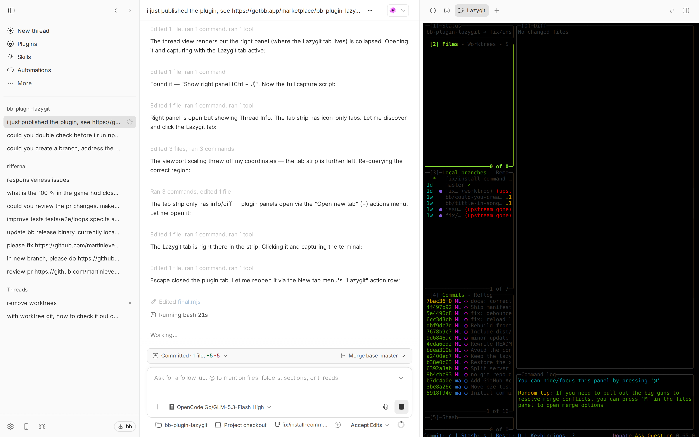

# bb-plugin-lazygit

Reviewing a thread's work shouldn't mean reaching for a separate terminal.
bb-plugin-lazygit auto-creates a
[lazygit](https://github.com/jesseduffield/lazygit) tab on every thread you
open — stage, commit, and inspect the worktree without leaving the thread.
Everything runs locally: no account, API key, or external service.



## Features

- **Automatic Lazygit tab** — a plugin-owned panel tab appears next to Thread
  Info and Diff in every thread you open, running lazygit in that thread's
  worktree. The process starts lazily the first time the tab is activated.
- **Persistent session** — the lazygit session survives tab switches, so your
  scrollback and state are still there when you come back.
- **Non-git folders handled** — if the thread's environment is not a git
  repository, the tab offers to `git init` it instead of failing.
- **Agent-friendly** — the bundled skill tells agents to open lazygit with
  `bb lazygit` instead of driving a full-screen TUI from a shell.

## Install

### Prerequisites

[lazygit](https://github.com/jesseduffield/lazygit#installation) must be on
your `PATH`.

```
bb plugin install lazygit
```

### From source

```
git clone https://github.com/martinlevesque/bb-plugin-lazygit.git
cd bb-plugin-lazygit
npm install
bb plugin install .
```

## Usage

Open any thread — the **Lazygit** tab appears in the right panel's tab strip.
To bring it back after closing it:

```
bb lazygit                    # current thread
bb lazygit --thread <id>      # a specific thread
```

## Configuration

- `autoOpen` (boolean, default `true`) — add a Lazygit terminal tab the first
  time a thread is opened. Set to `false` to open the tab only on demand.
- `command` (string, default `lazygit`) — the command run in the terminal
  tab. Override with a full path if lazygit is not on `PATH`.

```
bb plugin config lazygit                          # show current values
bb plugin config lazygit set autoOpen false
bb plugin config lazygit set command /opt/bin/lazygit
bb plugin reload lazygit
```

Settings are read once per load, so reload after changing them.

## Development

```
npm test            # vitest run — end-to-end backend tests
npm run typecheck   # tsc --noEmit
bb plugin build     # write dist/ for git/npm installs
bb plugin dev       # rebuild and reload on every save
```

The backend entry is `server.ts` (logic in `server/`), the frontend entry is
`app.tsx` (components in `app/`), and `PLUGIN_OVERVIEW.md` holds the store
listing text.
